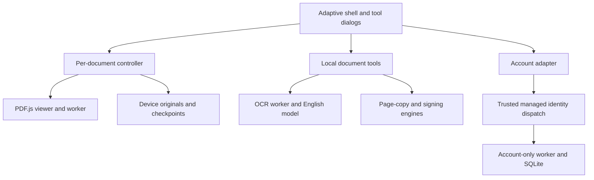

# Architecture

Updated: **2026-10-03 UTC**. This records implemented development architecture, not deployment or cross-platform certification. [Verification](docs/verification.md) controls completed test/build/CI claims.

PDF bytes flow through local browser memory, output and opt-in IndexedDB storage. The account branch carries account metadata only.

## Selected Approach and Boundaries

The shared application uses TypeScript/DOM, adaptive CSS and Vite. PDF.js 6.3.289 remains the sole reader/rendering stack. Its matching legacy viewer, display and worker modules share locally served fonts, CMaps, WASM and ICC resources. Browser and experimental Tauri targets reuse this UI and document core.

PDF.js owns supported annotation/form incremental writes. pdf-lib 1.17.1 supplies a deliberately restricted page-copy writer and independent object checks. @libpdf/core 0.5.1 supplies the certificate-signing incremental writer, with separate ASN.1/PKI.js verification. Tesseract recognizes bounded raster images. These engines have distinct contracts; a successful operation in one does not imply arbitrary editing support in another.

The static client builds to `dist/client`; the account worker is built separately. A static preview remains useful without account endpoints. No document upload, cloud OCR or server-side PDF processing endpoint exists.

## UI, Sessions and Platform Adapters

`src/main.ts` owns tabs, dialogs, controls, adaptive navigation and keyboard handling. Each of up to three sessions retains a controller. Inactive form DOM is detached to prevent PDF.js global widget lookups and duplicate radio names crossing documents. Page position survives reattachment.

`src/features/document-tools.ts` owns actual OCR, organization and certificate dialogs, including cancellation, progress, validated output and focus restoration. `src/features/device-library.ts` coordinates consent, local copies, recovery and optional account state. Tool results open as separate documents only on an explicit action.

`src/platform/browser.ts` owns file selection, downloads, print handoff and bounded recent metadata. Downloads report initiation, not disk completion. Print reserves a window during user activation and offers a local PDF to the browser's native viewer or download route. Physical printers and platform share sheets remain separate verification gates. Browser selection/clipboard and native text editing retain platform conventions.

## Document Controller and Lifecycle

`src/core/document-controller.ts` owns retained original bytes, loading/document proxies, viewer/link/find/editor managers, restrictions, dirty/revision state and serialized output.

Open -> preserve bytes -> worker parse -> inspect restrictions -> render/interact -> snapshot supported storage -> serialize -> reopen/check -> output or device checkpoint.

Encrypted, signed/signature-field, XFA and insufficiently permitted inputs are conservatively read-only. Inspection failures do not enable mutation. Read-only annotation-storage interception also prevents ResetForm actions from changing a protected document. A displayed signature or field is not a trust verdict.

A monotonic content revision distinguishes editing from navigation. Dirty detection includes unfinished FreeText drafts and pointer strokes; `checkpointPending` prevents pretending those drafts are safely serialized. Explicit consequential operations use `flushPendingEdits`; background recovery does not steal editor focus.

## Rendering, Search and Navigation

PDF.js provides text/annotation layers, lazy canvas rendering and bounded buffers. Current safeguards include four-million-pixel page canvases, an 8192 dimension limit, disabled detail canvases, 150 MiB input cap and three-document limit. Sequential/cancellable thumbnails have bounded dimensions/DPR. Page placeholders and parsed document structures still consume memory proportional to document complexity.

PDFFindController performs local text search and result navigation. OCR text is currently separate output, not injected into search or saved as a hidden layer. PDFLinkService resolves destinations; named actions/external URL schemes are restricted. Metadata and outlines are inserted as text. Reader view rotation is temporary; the organization tool's verified-copy rotation is permanent.

## Annotations, Forms and Undo/Redo

Authoring supports text/freehand highlight, FreeText and ink. Rendering existing annotations does not imply authoring every subtype; new underline, strikethrough and sticky notes are absent.

Supported AcroForm values use PDF.js annotation storage, including tested text, multiline, checkbox, dropdown and radio workflows. Existing accessible labels are preserved; unnamed widgets receive a field-name fallback. XFA, PDF calculations/scripts and submission remain disabled.

Annotation undo/redo delegates to PDF.js. Browser field/text editing keeps its native history; no unified form-history claim is made. Pending edits are flushed before explicit tools/export and document transitions.

## Reader Export and Checkpoint Strategy

All serialization goes through one controller queue. It takes an immutable storage snapshot, serializes supported changes, requires the exact original byte prefix, reopens output, checks page count/relevant geometry and verifies changed form values and annotation objects. Failure retains live edits and yields no successful output.

`exportBytes` tracks the exported snapshot; user acknowledgment marks only that version saved. Later edits remain dirty. `createCheckpoint` returns validated bytes/revision without acknowledging a save, and refuses unfinished editor/stroke states. Read-only output preserves original bytes. Prefix/object checks are complemented by fixture, browser and independent-reader tests; they do not establish universal visual fidelity.

There is no native atomic overwrite path. Neither downloads nor device checkpoints replace an external original file.

## Device Library and Recovery

`src/platform/local-library.ts` owns an **unencrypted IndexedDB** database with documents, originals, latest and usage stores. Keys partition guest or account-owner records. Partitions are organization, not a cryptographic security boundary. The database stores immutable original bytes and one latest full PDF revision, with SHA-256 integrity, sizes, revision counters and recovery flags.

Default per-owner limits are 500 documents and 512 MiB of combined original/distinct-latest PDF bytes, with a 150 MiB document limit. Browser quota/overhead may reduce available capacity. Transactions update records and usage together; compare-and-swap expected revisions refuse conflicting writers. New records store ArrayBuffers for WebKit portability; readers also accept legacy Blob records without resetting the schema or data. Crypto and any legacy Blob reads occur outside transactions. Quota/transaction failures preserve previously committed records.

The UI requires opt-in storage consent. Checkpoints are debounced 650 ms on actual content revisions, serialized per binding, and retried for newer changes. Unfinished annotations are deferred. Background persistence does not clear the document's dirty state. Closing/flushing checks for edits arriving during persistence. Discard restores the session's opened baseline, including a recovered baseline when applicable.

Reads validate metadata, PDF header and hash. Corrupt latest bytes do not silently fall back: the UI offers the preserved original explicitly and retains the damaged record. Record deletion is explicit and revision-guarded. Storage persistence requests are browser-controlled and do not guarantee retention. Browser/OS termination before a checkpoint, profile clearing and eviction can still lose work.

Account switching flushes tracked edits, closes old bindings and selects a partition; it does not migrate PDFs or synchronize devices. An optional cached account hint permits clearly labeled offline local access only. It is not authenticated server identity, and signing out does not erase local files.

## Hosted Account Service

`server/index.ts` exposes GET/POST `/api/account`; `server/accounts.ts` implements identity extraction and capacity registration. The managed host must strip user-supplied identity headers and inject authenticated user ID/email. **The worker must not be directly exposed on an endpoint that trusts client-controlled identity headers.** Actual deployed authentication remains a release gate.

The SQLite-compatible schema has unique user/account IDs and a checked slot primary key from 1 through 200. A single insert/select allocates an available slot atomically; existing accounts can be retrieved after capacity is full. This enforces registered-account count, not concurrent request throughput. The deployed D1 accounts table is confirmed; actual managed account sign-in remains unverified.

POST requires identity, same-origin request checks, JSON content type and a bounded 1 KiB body; it never accepts a client-chosen identity. Responses are private/no-store. Unknown routes, capacity, authentication and database outages produce explicit statuses. Only identity/account metadata is retained server-side; no PDF names, bytes, passwords or signing keys enter this API. Account deletion/admin operations are not implemented.

Platform sign-in/sign-out/callback routes belong to managed dispatch, not this worker. Static preview reports account service unavailable while guest local reading continues.

## OCR

`src/core/ocr.ts` renders permitted base PDF content and coordinates one sequential Tesseract worker. `ocr-worker.ts` owns the worker immediately so cancellation can terminate model/core initialization. Its inspected message protocol is version-sensitive; dependency upgrades require cancellation and recovery tests.

English model, worker and LSTM variants are self-hosted. Tesseract's independent model database is disabled; the application controls asset caching. Copy-restricted documents are rejected before engine/model work. Editor/form overlays are not flattened into OCR.

Jobs are bounded to 50 pages, four-million-pixel/4096-side rasters, 180 nominal DPI, two million text characters and explicit worker/page timeouts. Canvases and worker resources are released. Text, confidence and word geometry are estimates in original PDF coordinates. The UI exports plain text only: no source mutation, searchable layer, automatic deskew/orientation or semantic-layout guarantee. See [OCR research](docs/ocr-research.md).

## Safe-Copy Page Organization

`src/core/organize.ts` accepts copied input bytes and a copied one-based operation: extraction, full reorder, deletion retaining at least one page, permanent rotation or merge. Limits are 50 MiB combined input, 500 combined source pages and ten inputs.

Every source page is preflighted, including omitted pages. Reject encryption/permissions, forms, annotations/links, signatures, XFA, outlines, destinations, tags, layers, attachments/actions and unsupported catalog/page structures. Metadata/viewer preferences are deliberately omitted in the new page-only document, with an explicit UI explanation.

For each retained page, PDF.js captures text/geometry and normalized-rotation rendered pixels bounded to 512 pixels per dimension. After pdf-lib writes the new copy, PDF.js reopens and compares every output page; a separate pdf-lib reparse checks all page boxes. A failure returns no verified result. Sequential bounded canvases avoid retaining all page images, but writer/parser object graphs coexist and mutation is not a dedicated worker job. This is not full-resolution print or general semantic preservation. See [organization research](docs/organize-research.md).

## Certificate Signing

A fresh cancellable worker inspects a local P12/PFX certificate before explicit confirmation. Supported signing uses RSA 2048-8192-bit keys, SHA-256 and an invisible new field. Certificate date/key-usage checks and a key/certificate challenge precede signing. PDF input is limited to 20 MiB/200 pages and the certificate container to 1 MiB.

Preflight rejects encrypted/restricted, existing signature/DocMDP/FieldMDP/signature-field, XFA, repaired or linearized inputs that cannot satisfy this incremental path. The output must preserve the exact input prefix and page/form/annotation resources. Independent ASN.1/PKI.js checks verify exact byte-range coverage, detached CMS digest/signature and certificate correspondence; unexpected trailing unsigned bytes or tampering fail.

The result deliberately says **integrity verified; trust not verified; revocation not checked; timestamp not requested**. It does not verify arbitrary existing signatures, legal identity, trusted timestamps or PAdES conformance. No OCSP/AIA/TSA contact is performed. P12/password material exists transiently in UI and worker memory until completion/cancellation; controlled buffers/references are cleared and workers terminated. No credential persistence/logging is implemented, and JavaScript cannot guarantee physical erasure of every runtime copy.

## Offline, Security and Logging

The generated service worker versions an asset allowlist and keeps builds consistent. Optional OCR assets are cached on explicit use, avoiding an initial download of every engine variant. User PDF/Blob URLs and account requests are excluded from that app cache. Opt-in PDF persistence belongs only to the separate device library. First retrieval needs network. Local reader/OCR offline checks passed. Initial hosted reload failed because a cached canonical-redirect response was rejected for Chromium navigation. Cached navigation responses are now normalized; the regression failed against the old worker and passed with the fix on Edge/WebKit. The second deployment passed live Chromium offline reload and local recovery. Browser eviction remains a limitation.

No PDF scripting manager/QuickJS resource, launch command or embedded-media execution is integrated. The obsolete `isEvalSupported` switch is not available in the installed PDF.js version. Permission checks, safe URL schemes, same-origin engine assets, CSP and worker isolation form the actual boundaries.

The account worker adds CSP and response headers; development/preview and native contexts have their own policy. Live static hosting bypassed worker static-response headers: document metadata CSP was confirmed, while HTTP CSP/frame-ancestors/nosniff and Referrer-Policy enforcement need host support. Metadata CSP and the no-referrer policy are confirmed in the second deployment. Actual managed sign-in remains unverified despite successful anonymous/forged-header/redirect checks. Logs must exclude PDF content, account identity details, passwords and keys. Visible errors preserve editable state or previously committed copies rather than claiming success.

## Native Integration

`src-tauri/` embeds the same client with Windows WebView2/macOS WKWebView. Configured targets are NSIS, app and DMG; no custom native commands, filesystem/shell plugins or privileged IPC permissions are enabled. Native menus, file associations, atomic saves, signing/notarization, updates and share sheets are absent.

The inspected Windows environment lacks Rust/cargo/MSVC/Windows SDK prerequisites. Local native compilation/runtime is blocked. Remote CI successfully built Windows NSIS and macOS app/DMG packages using the retained Cargo lockfile; upgraded macOS WebKit browser CI also passed. Native custom-origin workers, downloads/popups, account flow and offline behavior require their own tests even after compilation. See `src-tauri/README.md`.

### Windows Release Boundary

The new `windows-release.yml` workflow separates building/installing from publishing. The release-specific Tauri config adds native notices as installer resources and uses current-user installation; it adds no privileged app commands. The planned output is an unsigned x64 EXE under `v0.1.0-preview.1`. This workflow and its installed-app smoke are implemented but not yet evidenced as successful or published.

The build collects notices with pinned `cargo-about 0.9.2`, original license texts, Cargo checksum validation, exact-version MPL source archives and Rust/NSIS/WebView2 platform notices. It then compiles, installs only beneath a validated disposable runner directory, and tests the actual installed WebView2 application with an isolated profile and process-scoped loopback debugging. Network observation covers app requests from a controlled reload, not OS/runtime update traffic.

Publication is a separate main-only job: exact-commit Reader checks, same-workflow artifact digest, bounded inventory extraction, per-file checksums and release-tag identity must agree. Mismatched existing tags/assets are refused; validated files pass through a draft prerelease before publication. `release-provenance.json` links source, workflow, native report and notice manifest. Guest desktop reading/storage has no ChatGPT/account dependency; managed accounts remain a website integration. A passed gate, once observed, establishes only its explicit coverage.

## Alternatives and Verification

PDFium adds native/WASM bindings and packaging; MuPDF/Poppler require deliberate copyleft/commercial-license decisions; Flutter/Qt add browser/accessibility integration; Electron does not address phone/browser sharing; React Native needs document bridges. A thin Tauri wrapper can reuse the current core without claiming native integration already exists.

Tests cover adapters, SQLite account rules, device persistence, fixtures, controller checkpoints, page operations, signing cryptography and browser workflows. Fidelity fixtures and visual reviews supplement parser/object checks. Accessibility automation is targeted, with unresolved manual reading-order/assistive-technology work recorded in [the audit](docs/accessibility-audit.md). The upgraded CI passed 55 unit checks, 63 E2E cases on each of Linux Chromium and macOS WebKit, seven checkpoint cases and nine signing cases. Browser emulation is not physical-device evidence. Exact run/deployment provenance is in verification.
