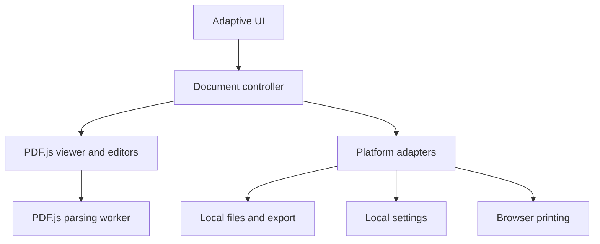

# Architecture

Decision date: 2026-10-02. Status: selected; implementation in progress.

## Selected approach
One responsive web core, TypeScript, a modular DOM UI and Vite. PDF.js 6.3.289 provides parsing, rendering, text selection, navigation, search and supported forms/editor serialization. Its Apache-2.0 license is permissive with notice obligations. The legacy engine build is evaluated for compatibility; real-browser evidence controls support claims. pdf-lib (MIT) is a development fixture generator, not the app mutation engine.

## Boundaries
The UI owns presentation, focus and adaptive panels. The controller owns loading tasks, viewer state, permissions, dirty state and document lifetime. PDF.js owns the shared engine, worker, rendering queue, text/annotation layers and incremental saving. Browser adapters own opening, exporting, printing and settings. No backend or upload endpoint.

## Subsystems
Annotation/forms use PDF.js storage and native editor managers, not lossy rasterization. Search uses PDF.js find controller. Outlines/properties come from PDF metadata. Recent-file records must not promise unattended reopening when the browser has no persistent handle. Undo/redo must correspond to actual edits. Print must expose platform constraints. OCR and certificate signing are deferred. Basic placed signatures, if added, are explicitly not cryptographic signatures.

## Save strategy
Preserve original input; serialize only supported modifications; validate output can reopen before offering a new download. Protected/signed/unsupported documents must not be silently rewritten. Failed saves keep dirty state. Native atomic writes are deferred with the native adapter.

## Security and errors
PDFs are hostile input. Disable eval and scripting; never execute launch actions or embedded programs; validate external link schemes. Keep engines/workers/assets local. Do not leak document data via analytics/logging. Surface invalid password, unsupported format, storage, memory, renderer, save and print failures.

## Performance
Use PDF.js lazy rendering and rendering queue, bounded canvas resolution and cancellation. Measure first render and search on synthetic fixtures. Do not infer physical-mobile performance from desktop emulation.

## Alternatives considered
Native PDFium: permissive core but wrapper/WASM integration and separately audited dependencies increase initial complexity. MuPDF/Poppler: licensing constraints need a deliberate distribution decision. Qt/Flutter: mature native approaches but web integration and accessible browser UI would add adapters. Electron: desktop-only shell does not solve mobile/web. React Native: would need a separate web reader bridge. Tauri: useful later desktop/mobile wrapper but not required for the browser core. A UI framework is unnecessary for this first bounded shell; keep modules small and independently testable.

## Testing and capability matrix
See PROJECT.md and the forthcoming docs/verification.md for actual results. Unit tests cover safety boundaries; browser tests cover reading, search, annotation/form export-reopen, errors, and responsive interaction. Physical device and native packaging support require independent evidence.
